# 2 Species SPLIT-STED

All the codes used to produce figures and analyze data for:  
Three-Component Phasor-Based Linear Unmixing Approach for Simultaneous Fluorophore Discrimination and Resolution Improvement of Stimulated Emission Depletion Microscopy Images Using Fluorescence Lifetime
## Installation and requirements

## Folder contents
### Acquisition
Codes to perform automatic image acquisition with different depletion powers on an Abberior Expert Line STED microscope. Based on the [specpy](https://pypi.org/project/specpy/) and [Abberior-STED](https://https://github.com/FLClab/Abberior-STED) libraries

* **FLIM_AutoAcquire_VaryPower_ConfocalsPrePost**: Main program that coordinates the acquisition sequence, randomly selects depletion power values from a list of repeated values and sets the value for acquisition. For each region, it lauches the acquisition a predefined sequence of images :
1) Confocal image
2) Pair of STED-FLIM and Confocal-FLIM images
3) Confocal image.
### Functions
Functions called in other folders
* **Main_Functions**: Contains phasor calibration codes, foreground detection

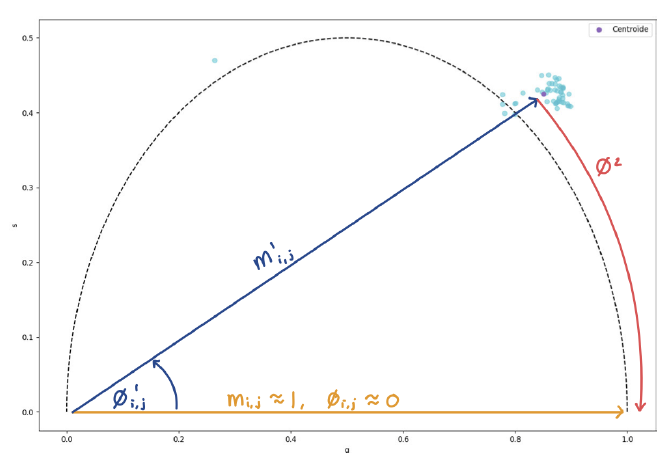

* **Phasor_functions**: Contains code to calculate both median and [CWF](https://doi.org/10.1364/BOE.420953) filtered phasor distributions, codes to perform unmixing and SPLIT-STED. 
* **convertmsr_bioformatsAB**: Contains MSRReader class which allows to read msr files (raw data files saved by Abberior microscope)
* **objectives** : Contains photobleaching and [SQUIRREL metric](https://doi.org/10.1038/nmeth.4605) calculation functions
* **decorr_res** : Function to calculate image resolution based on [Decorrelation analysis](https://doi.org/10.1038/s41592-019-0515-7)
* **lifetime** : Function to create images colorcoded by lifetime overlayed on the intensity values.

###  Histograms
Curve fitting of FLIM histograms
* **IRF measurement_Gaussfit**: Fits a gaussian function onto the histogram of an IRF measruement (imaging a sample of gold nanoparticles)
* **Hist_monoexp_MLE_foreground**: Sums histograms of all pixels in the foreground of a FLIM image and fits a single exponential function to the data using MLE error estimation
* **Hist_monoexp_MLE_foreground_AllFolder**: Same as **Hist_monoexp_MLE_foreground** but repeats for all the FLIM images in a folder and saves results to a csv file.
* **Hist_monoexp_MLE_pixelwise**: Fits a single exponential function to the histogram of every pixel in an image data using MLE error estimation.
* **Hist_monoexp_MLE_pixelwise_AllFolder**: Same as **Hist_monoexp_MLE_pixelwise** but repeats for all the FLIM images in a folder

### PhasorDistribution
Display and analysis of phasor distributions of STED-FLIM images

* **PhasorDistribution_STED_EllipseFit_2Species** Analysis of phasor distribution trajectories as a function of STED depletion power by fitting ellipses on phasor distributions. Saves metrics (shortest distance between ellipses, IOU, distance between ellipse centroids , ...) to a csv file and graphs properties (mean phasor centroid, ellipse dimensions) for each depletion power.

    
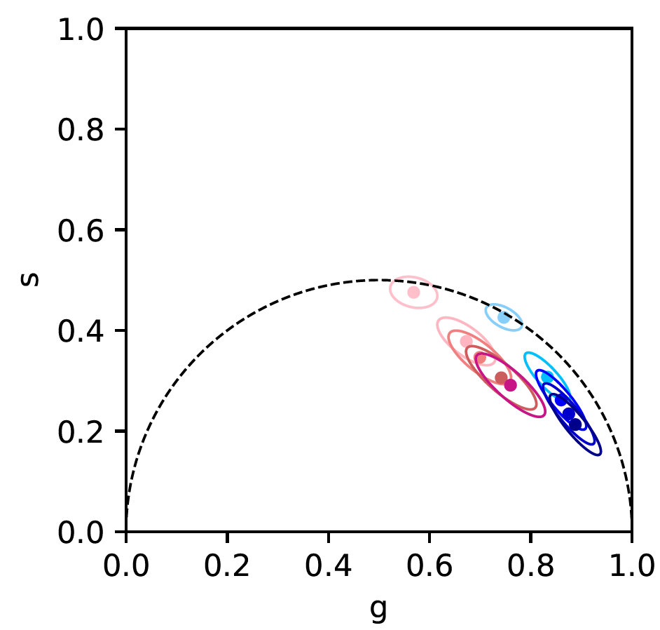

 
 
   
<em>Mean ellipse and centroid for each depletion power </em>

 
 

* **ReadCSVtoGraphs_EllipseFit**: Reads csv file produced by **PhasorDistribution_STED_EllipseFit_2Species** and plots the different metrics as a function of depletion power
* **PhasorDistribution_STED_3DGraph** Makes 3D graph of phasor distributions of 2 stainings as a function of STED depletion power 

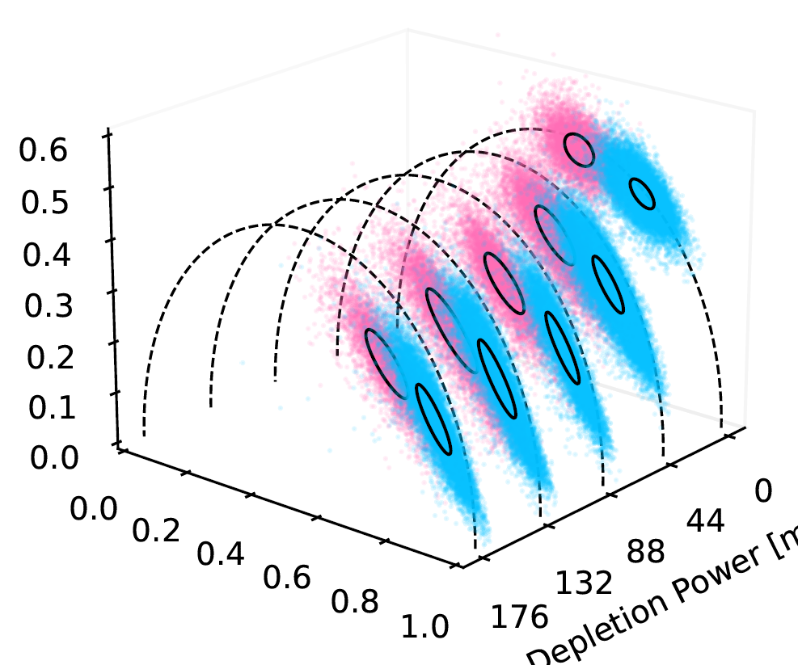
 
 
   
<em>3D graph of phasors of 2 dyes as a function of depletion power</em>

 
 

* **PhasorDistribution_PrevsPostCalibration**: Plots a phasor before and after the calibration with the IRF

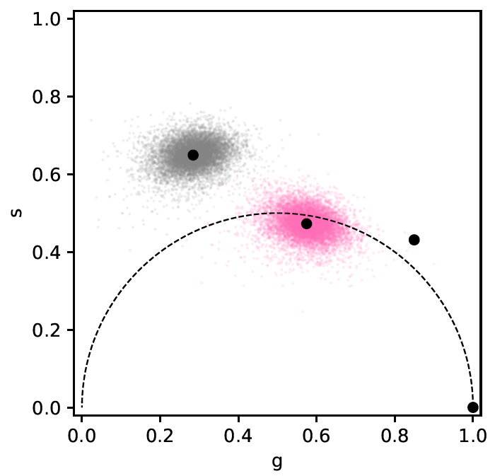
 
 
   
<em>phasors before and after application of calibration</em>

 
 

* **PhasorDistribution_RawvsMedianvsCWF**: Plots the same phasor with different filtering techniques (raw,median and CWF)

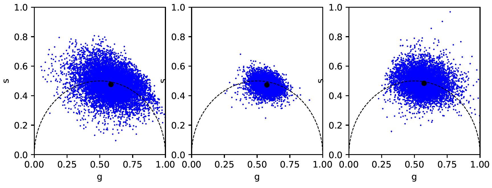
 
 
   
<em>phasors before and after application of median and CWF filters</em>

 
 

### SPLIT-STED
1 Species [SPLIT-STED](https://doi.org/10.1039/C8NR07485B) to improve resolution of single staining STED-FLIM images
* **SPLIT-STED_CWF_multiSTEDpercent_Metrics**: 1 species SPLIT-STED of all images in a folder with [*CWF filtering*](https://doi.org/10.1364/BOE.420953) of phasors. Saves resolution, photobleaching and SQUIRREL metrics of the input and output images in a csv file
* **SPLIT-STED_Median_multiSTEDpercent_Metrics**: 1 species SPLIT-STED of all images in a folder with *median filtering* of phasors. Saves resolution, photobleaching and SQUIRREL metrics of the input and output images in a csv file
  
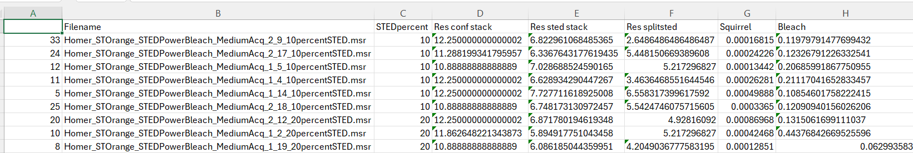  

    
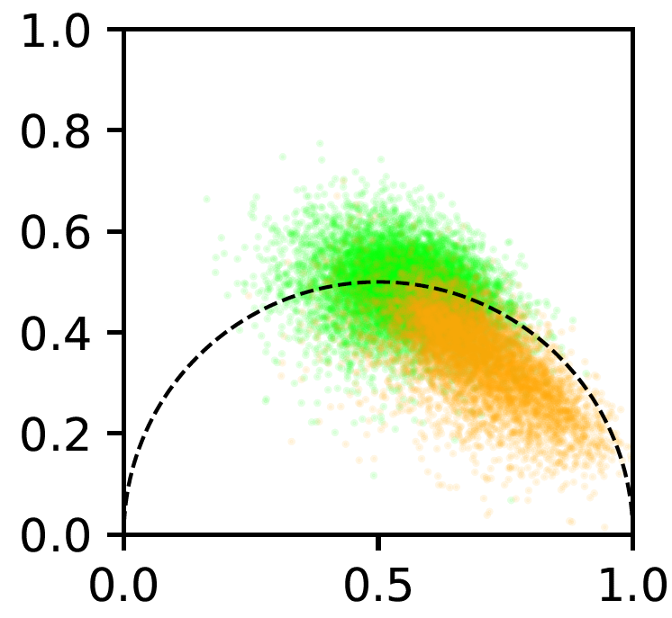
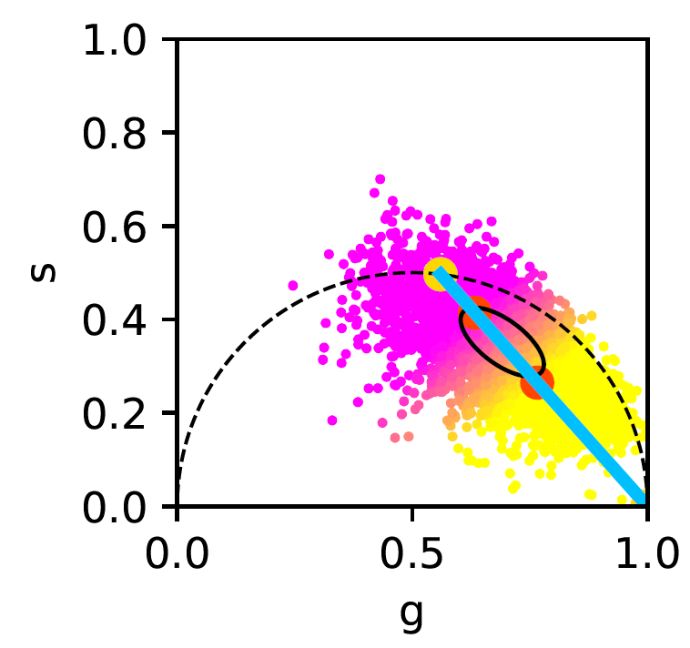  

    
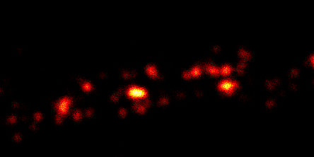
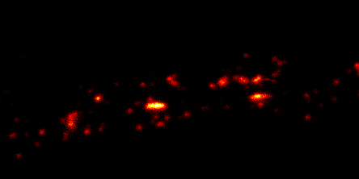
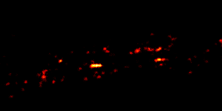  

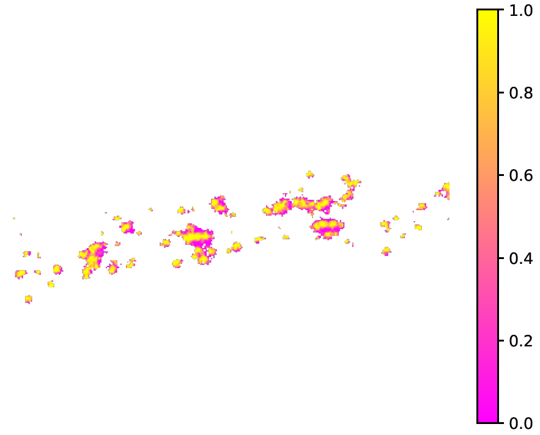

* **ReadCSVstoGraphs_EllipsesvsSPLITresolution**: Read csv files generated by SPLIT-STED codes and **PhasorDistribution_STED_EllipseFit_2Species** and produces graphs

### Unmixing
Algorithms to separate dyes of different lifetimes in Confocal-FLIM and STED-FLIM images using [linear systems of equations in phasor space](https://doi.org/10.1088/2050-6120/ab8570)
* **Unmixing_2SpeciesSPLITSTED.ipynb**: Jupyter Notebook implementation of 2 Species SPLIT-STED. Takes tiff images as input. Example data will be downloaded from  _______ into **Example_data** subfolder
* **Unmixing_2SpeciesConfocalFLIM__allfolder** : Separate phasors of Confocal-FLIM images of double-stained samples into two fractional components. Uses the same pair of control images for the entire folder of mixed images
* **Unmixing_2SpeciesSTEDFLIM_allfolder**: Separate phasors of STED-FLIM images of double-stained samples into two fractional components. Uses the same control images for all mixture images acquired with the same depletion power (1 pair of controls per depletion power)
* **Unmixing_2SpeciesSPLITSTED_allfolder** :  Separate phasors of STED-FLIM images of double-stained samples into three fractional components. Uses the same control images (4 per dye, confocal and 3 depletion powers) for all mixture images.

### Simulation
Creates simulated double-staining images by summing single-staining STED-FLIM images and performs different unmixing algorithms to evaluate their performance in a controlled setting.
* **HistogramMLE_MonoExponential_Simulationimages**: Generate simulated images and perform MLE histogram fitting to generate color-coded lifetime images of the ground truth and mixed images

    
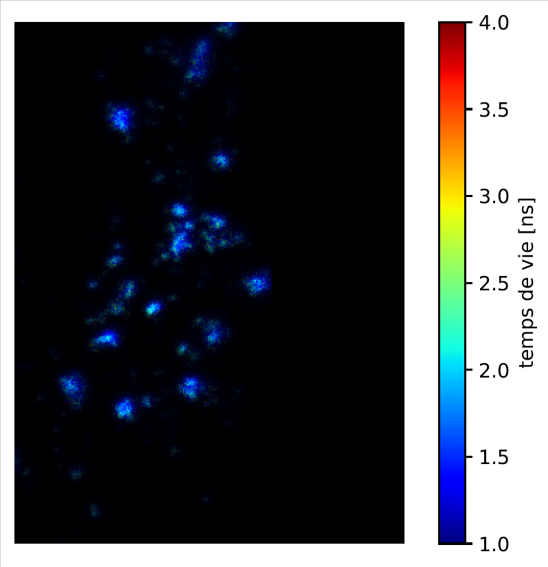
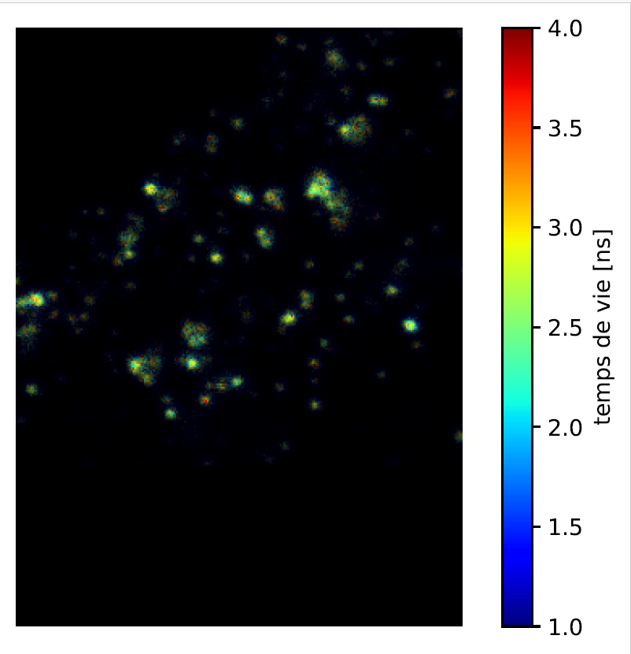
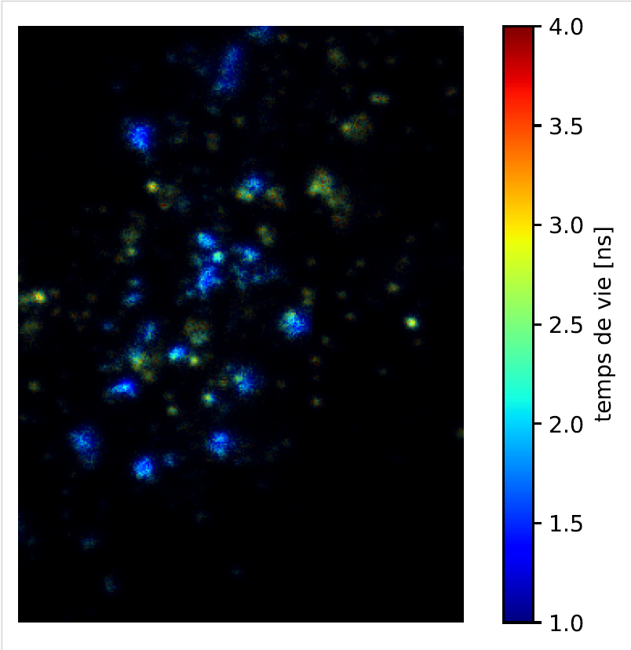

* **Simulation_2SpeciesSTED-FLIM_looppowers** : Generate simulated images and perform 2 Species STED-FLIM unmixing. Calculate metrics (resolution, squirrel) and save them to a csv file. Also save input images and unmixing results (color-coded phasor and images) for each simulated combination.
* **Simulation_2SpeciesSPLIT-STED_looppowers**: Generate simulated images and perform 2 Species SPLIT-STED unmixing. Calculate metrics (resolution, squirrel) and save input images and unmixing results (color-coded phasor and images)
* **ReadCSVstoGraphs_Simulation** : Read the csv files produced by **Simulation_2SpeciesSTED-FLIM_looppowers** and **Simulation_2SpeciesSPLIT-STED_looppowers** and produce comparison graphs of the performance metrics of both unmixing methods as a function of the depletion power.

