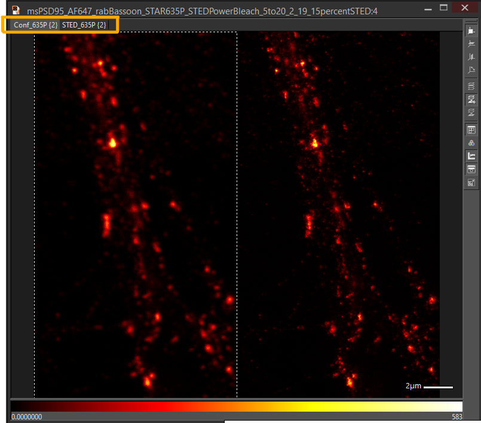
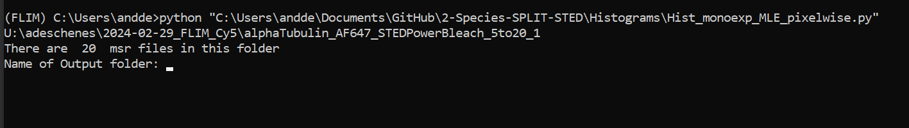
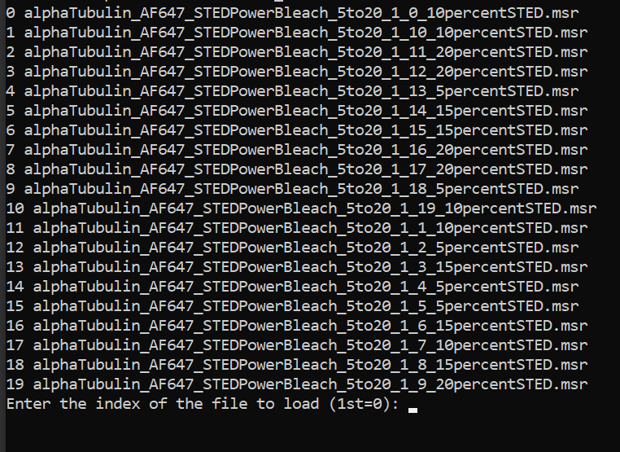

# 2 Species SPLIT-STED

All the codes used to produce figures and analyze data for:  
_Enhancing STED Microscopy via Fluorescence Lifetime Unmixing and Filtering in Two-Species SPLIT-STED._
 
 A preprint version of the paper is available <a href="https://doi.org/10.1101/2025.07.17.661952">here</a>.

The Confocal- and STED-FLIM images of neuronal proteins dataset is available to downlad from the [Zenodo dataset](https://doi.org/10.5281/zenodo.15438494)

The README is divided into the following sections
- [Installation and Requirements](#installation)
- [Folder contents](#toc)
    - [Acquisition](#acquisition)
    - [Functions](#functions)
    - [Histograms](#histograms)
    - [Phasor Distribution](#phasordistribution)
    - [SPLIT-STED](#split-sted)
    - [Unmixing](#unmixing)
    - [Simulation](#simulation)
- [Usage Notes](#usage)
- [Citation](#citation)

<a id="installation"></a>
## Installation and Requirements

The source code `2 Species SPLIT-STED` relies on Python scientific librairies. The source code was tested in a Python 3.11 environnement. We provide a `requirements.txt` file to facilitate the installation of the necessary dependencies.

Assuming the users have a working installation of Python on their computer (we recommend using Anaconda. See [installation instructions](https://docs.anaconda.com/anaconda/install/)), and [cloned](https://docs.github.com/en/repositories/creating-and-managing-repositories/cloning-a-repository) this repository on their computer, the users should create a new Python 3.11 environnement to avoid impacting on other file dependencies. 

The following lines create a new environnement called FLIM, containing the necessary dependencies. `requirements.txt` is the path to this file obtained from this repository.
```bash
conda create -n FLIM python=3.11.4
conda activate FLIM
pip install -r requirements.txt
```
 If available, install the specpy package provided with the Imspector software for your specific python version. 

All data is provided as both .tiff and .msr files in the [Zenodo dataset](https://doi.org/10.5281/zenodo.15438494) and the scripts can read both file formats. To use these scripts with other data formats, simply change the *load_image* and *select_channel* functions in **Functions/Main_Functions.py**.

<a id="toc"></a>
## Folder contents
<a id="acquisition"></a>
### Acquisition
Code to perform automatic image acquisition with different depletion powers on an Abberior Expert Line STED microscope. Based on the [specpy](https://pypi.org/project/specpy/) and [Abberior-STED](https://https://github.com/FLClab/Abberior-STED) libraries

- `FLIM_AutoAcquire_VaryPower_ConfocalsPrePost.py`: Main program that coordinates the acquisition sequence, randomly selects depletion power values from a list of repeated values and sets the value for acquisition. For each region, it lauches the acquisition a predefined sequence of images :
1) Confocal image
2) Pair of STED-FLIM and Confocal-FLIM images
3) Confocal image.
   
Codes to pre-process the acquired images.
- `convert_msr_to_tiff_composite_LUT_Specpy.py`: Script used to convert raw measurement files (.msr) into Tiff files. Tiff files are structured as (x,y,c=2,t=250) c being Confocal and STED, t being the time bins.
- `IRF measurement_Gaussfit_PhasorCentroid.py`: Fits a gaussian function onto the histogram of an IRF measruement (imaging a sample of gold nanoparticles). Also returns the centroid of the IRF's phasor distribution which is used to calibrate the phasors. An example IRF measurement is in the *IRF_Measurement* subfolder.


<a id="functions"></a>
### Functions
Functions called by scripts in other folders
- `Main_Functions.py`: Contains functions to load and read images and phasor calibration functions
- `Phasor_functions.py`: Contains code to calculate both median and [CWF](https://doi.org/10.1364/BOE.420953) filtered phasor distributions, codes to perform unmixing and SPLIT-STED. 
- `objectives.py` : Contains photobleaching and [SQUIRREL metric](https://doi.org/10.1038/nmeth.4605) calculation functions
- `decorr.py`: Function to calculate image resolution based on [Decorrelation analysis](https://doi.org/10.1038/s41592-019-0515-7). Script originally made by [(Bilodeau et al., 2024)](https://doi.org/10.1101/2024.03.25.586697) and available [here](https://github.com/FLClab/bandit-optimization)

<a id="histograms"></a>
###  Histograms
Curve fitting of FLIM histograms

- `Hist_monoexp_MLE_foreground.py`: Sums histograms of all pixels in the foreground of a FLIM image and fits a single exponential function to the data using MLE error estimation
- `Hist_monoexp_MLE_foreground_AllFolder.py`: Same as **Hist_monoexp_MLE_foreground** but repeats for all the FLIM images in a folder and saves results to a csv file.
- `Hist_monoexp_MLE_pixelwise.py`: Fits a single exponential function to the histogram of every pixel in an image data using MLE error estimation.
- `Hist_monoexp_MLE_pixelwise_AllFolder.py`: Same as **Hist_monoexp_MLE_pixelwise** but repeats for all the FLIM images in a folder
<a id="phasordistribution"></a>
### PhasorDistribution
Display and analysis of phasor distributions of STED-FLIM images

- `PhasorDistribution_STED_EllipseFit_2Species.py` Analysis of phasor distribution trajectories as a function of STED depletion power by fitting ellipses on phasor distributions. Saves metrics (shortest distance between ellipses, IOU, distance between ellipse centroids , ...) to a csv file and graphs properties (mean phasor centroid, ellipse dimensions) for each depletion power.
- `ReadCSVtoGraphs_EllipseFit.py`: Reads csv file produced by **PhasorDistribution_STED_EllipseFit_2Species** and plots the different metrics as a function of depletion power
- `PhasorDistribution_STED_3DGraph.py` : Makes 3D graph of phasor distributions of 2 stainings as a function of STED depletion power 
- `PhasorDistribution_PrevsPostCalibration.py`: Plots a phasor before and after the calibration with the IRF
- `PhasorDistribution_RawvsMedianvsCWF.py`: Plots the same phasor with different filtering techniques (raw,median and CWF)
<a id="split-sted"></a>
### SPLIT-STED
Single-species [SPLIT-STED](https://doi.org/10.1039/C8NR07485B) to improve resolution of single fluorophore STED-FLIM images
- `SPLIT-STED_CWF_multiSTEDpercent_Metrics.py`: single-species SPLIT-STED of all images in a folder with [*CWF filtering*](https://doi.org/10.1364/BOE.420953) of phasors. Saves resolution, photobleaching and SQUIRREL metrics of the input and output images in a .csv file
- `SPLIT-STED_Median_multiSTEDpercent_Metrics.py`: single-species SPLIT-STED of all images in a folder with *median filtering* of phasors. Saves resolution, photobleaching and SQUIRREL metrics of the input and output images in a .csv file
- `ReadCSVstoGraphs_EllipsesvsSPLITresolution.py`: Read .csv files generated by SPLIT-STED codes and **PhasorDistribution_STED_EllipseFit_2Species.py** and produces graphs

<a id="unmixing"></a>
### Unmixing
Algorithms to separate dyes of different lifetimes in Confocal-FLIM and STED-FLIM images using [linear systems of equations in phasor space](https://doi.org/10.1088/2050-6120/ab8570)
- `Unmixing_2SpeciesSPLITSTED.ipynb` Jupyter Notebook implementation of two-species SPLIT-STED. A small set of example data is downloaded by the script from this repository into an **Example_data** subfolder if it is not already present.
- `Unmixing_2SpeciesConfocalFLIM__allfolder.py` : Separates phasors of two-species Confocal-FLIM images into two fractional components. Uses the same pair of control images for the entire folder of mixed images
- `Unmixing_2SpeciesSTEDFLIM_allfolder.py`: Separates phasors of two-species STED-FLIM images into two fractional components. Uses the same control images for all two-species images acquired with the same depletion power (1 pair of controls per depletion power)
- `Unmixing_2SpeciesSPLITSTED_allfolder.py` :  Separates phasors of two-species STED-FLIM images into three fractional components. Uses the same control images (4 per dye, 1 confocal and 3 STED with different depletion powers) for all two-species images.
- `LineProfile_Nchannels_tifffile_1graphperline_.py`: Plots intensity profiles (with interactive window to select lines)
<a id="simulation"></a>
### Simulation
Creates synthetic double-species images by summing single-species STED-FLIM images, performs different unmixing algorithms and evaluates their performance.
- `HistogramMLE_MonoExponential_Simulationimages.py`: Generates synthetic two-species images and performs MLE histogram fitting to generate color-coded lifetime images of the ground truth and synthetic images
- `Simulation_2SpeciesSTED-FLIM_looppowers.py` : Generates synthetic two-species images and performs two-species STED-FLIM unmixing. Calculates metrics (resolution, SQUIRREL) and saves them to a .csv file. Also saves input images and unmixing results (color-coded phasor and images) for each synthetic image.
- `Simulation_2SpeciesSPLIT-STED_looppowers.py`: Generates synthetic two-species images and perform two-Species SPLIT-STED unmixing. Calculates metrics (resolution, SQUIRREL) and saves input images and unmixing results (color-coded phasor and images)
- `ReadCSVstoGraphs_Simulation.py` : Reads the .csv files produced by **Simulation_2SpeciesSTED-FLIM_looppowers.py** and **Simulation_2SpeciesSPLIT-STED_looppowers.py** and produces comparison graphs of the performance metrics of both unmixing methods as a function of the depletion power.

<a id="usage"></a>
### Usage notes
Here is a summary of the main parameters that the different scripts require

- filename : Path to a folder containing images. For most scripts, a dialog box is generated using the  [easygui](https://pypi.org/project/easygui/) package for the user to browse their computer and select the folder using this line.
```
filename=easygui.diropenbox()
```
This line can be replaced by an explicit statement of a folder path.

- keys : Identifiers to select the correct imaging channel from the image file. 
    - For .tiff files, integer that corresponds to the channel (0:Confocal or 1:STED)
    - For .msr files, string that corresponds to the channel name in Imspector as shown in the yellow box in the image below. When an incorrect key is entered, the select_channel function will print a list of available keys.

 

- savefolder : The name for the Results folder that will be created on the Desktop. In most scripts, the user will be prompted to enter the name. 

This can be replaced by an explicit statement of a string to use as the results folder name.

- numim : Integer to identify specific images in a folder. For some scripts, a list of the image names and indexes will be printed and the user will be prompted to enter the index.

This can be replaced by an explicit statement of an integer to use as the index.


<a id="citation"></a>
## Citation
If you use any material from this repository please cite the following preprint:
> Deschênes, A. et al. Enhancing STED Microscopy via Fluorescence Lifetime Unmixing and Filtering in Two-Species SPLIT-STED. bioRxiv 2025.07.17.661952 (2025) doi:10.1101/2025.07.17.661952.

```
@article{deschenes2025,
  title = {Enhancing {{STED Microscopy}} via {{Fluorescence Lifetime Unmixing}} and {{Filtering}} in {{Two-Species SPLIT-STED}}},
  author = {Desch{\^e}nes, Andr{\'e}anne and Ollier, Antoine and Lafontaine, Marie and {Michaud-Gagnon}, Albert and Santiague, Jeffrey-Gabriel Steavan and Bilodeau, Anthony and Gagn{\'e}, Christian and {De Koninck}, Paul and {Lavoie-Cardinal}, Flavie},
  year = {2025},
  month = jul,
  pages = {2025.07.17.661952},
  issn = {2692-8205},
  doi = {10.1101/2025.07.17.661952},
  urldate = {2025-07-18},
  chapter = {New Results},
  copyright = {{\copyright} 2025, Posted by Cold Spring Harbor Laboratory. This pre-print is available under a Creative Commons License (Attribution-NonCommercial-NoDerivs 4.0 International), CC BY-NC-ND 4.0, as described at http://creativecommons.org/licenses/by-nc-nd/4.0/},
  langid = {english}
}
```
